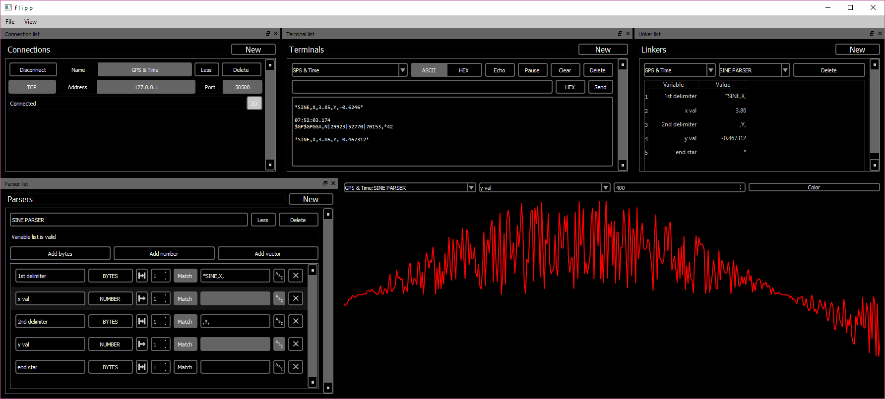

flipp
==========

##Flexible Integrated Parser and Plotter

This program will provide an interface to do the following:

1. Connect to a TCP, UDP, or serial data stream.
2. Build a set of variables to look for in the stream.
3. Plot the values found in the stream in real time.

Right now only the first two are in place. I am working on the parser engine, while at the same time iterating over a number of UIs to provide an intuitive and efficient workflow.

###This is very much a work in progress!

In order to build this project you need to install the QtSerialPort module.

## Installing QtSerialPort

Go to the [QtSerialPort page](http://qt-project.org/wiki/QtSerialPort) in the Qt Project Wiki for most up-to-date instructions. They didn't really work for me when I followed them to the letter, but the following steps should get you up and running. At least they worked on my Windows 8 machine, as of 2013-03-03:

1. Install Perl and make sure it's in your system PATH.
2. Download the QtSerialPort source:

    *git clone git://gitorious.org/qt/qtserialport.git*
3. Open up a Qt command prompt and go to the project folder.

    *C:\qt-qtserialport> qmake qtserialport.pro*
	
	*C:\qt-qtserialport> qmake*
	
	*C:\qt-qtserialport> mingw32-make*
	
	*C:\qt-qtserialport> mingw32-make install*
4. Open a project in Qt Creator and add this to your **.pro** file:
    
	QT += serialport
5. And these includes (only the first one is necessary):

    \#include \<QtSerialPort/qserialport.h>

    \#include \<QtSerialPort/qserialportinfo.h>
6. Use the **QSerialPort** class as your IO device. Look at my DataConnection class for more tips on usage.

